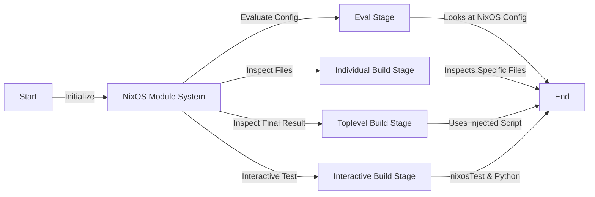

# Problem statement

Current security standards are typically dificult to apply and maintain over time.

The process for validation a linux system to be in compliance with a security standard is usualy done after the build is finished.
Upon which any future deviation is likely to break that validation requiring another audit.
This creates a problem with golden images a user is expected to create a snapshot of the validated config and deviate as little as possible.

# Project Goal

This project aims to democratise security by turning the paradigm on its head.
Rather than make a system we build then validate; We design a system that will only build *if valid*.
This system aims to build of the nixos module system which already has many likely configs codified and accessible to the public.

# Current state of the project.

A present, a rough understanding of what the interface should be exists.
It is known all the undelying mechanisms to be used to acheive this feature, thus removing uncertainty of completion.


# Features

- Eval time checks based off nixpkgs.
- Build time checks using the toplevel derivation.
- Build time Individual file checks using derivations.
- Runtime checks via a nested NixOSTest vm.
- A report tied to the build showing all checks run on the system.

# Visual

# Example Usage

## Consumer

```nix
{ config, lib, pkgs, ... }:{
    regula = {
        enable = true;
        profile.cis."v2.0.0".enable = true;
    };
}
```

## Developer

```nix
{ config, lib, pkgs, ... }:
let cfg = config.regula.profile.cis."v2.0.0" in {
    options.regula.profile.cis."v2.0.0".enable = lib.mkEnableOption "enables cis v2";
    config = lib.mkIf cfg.enable {
        regula.rules = {
            noSshRootLogin = {
                # it may be useful to declare a rule but not enable yet, allows for better configuration.
                enable = true;
                # this mode is an eval time check that passes into assertions = [];
                mode = "assertion";
                assertion = (config.services.openssh.enable -> (config.services.openssh.settings.PermitRootLogin == "no"));
                # within here we can pass any information to better understand why this assrtion failed;
                discovery = [{
                    Organization = "cis";
                    Section = "5.2.10";
                    Title = "Ensure SSH root login is disabled";
                    Page = "417";
                    ProfileApplicability = "Level 1: [Server, Workstation]";
                    Rational = ''
                        Disallowing root logins over SSH requires system admins to authenticate using their own
                        individual account, then escalating to root via sudo or su. This in turn limits opportunity for
                        non-repudiation and provides a clear audit trail in the event of a security incident
                    '';
                }];
            };

            noSshRootLoginTopLevel = {
                # it may be useful to declare a rule but not enable yet, allows for better configuration.
                enable = true;
                # this is for writing a script to run at toplevel of the build
                mode = "toplevel";
                # when using toplevel mode assertion is used to determin if the script should exist.
                # The reason for this is one should not run a script if the service isnt even enabled thus saving compile time.
                assertion = config.services.openssh.enable ;
                script = (pkgs.writeScript "ssh-PermitNoRootLogin" ''
                    ${pkgs.gnugrep}/bin/grep -q "PermitRootLogin no" $out/etc/ssh/sshd_config
                '');
                # within here we can pass any information to better understand why this assrtion failed;
                discovery = [{
                    Organization = "cis";
                    Section = "5.2.10";
                    Title = "Ensure SSH root login is disabled";
                    Page = "417";
                    ProfileApplicability = "Level 1: [Server, Workstation]";
                    Rational = ''
                        Disallowing root logins over SSH requires system admins to authenticate using their own
                        individual account, then escalating to root via sudo or su. This in turn limits opportunity for
                        non-repudiation and provides a clear audit trail in the event of a security incident
                    '';
                }];
            };
        };
    };
}
```
## Module Backend

```nix
{config, pkgs, lib, ... }:
let
    inherit (rlib)
        regulaModuleAssertion regulaParseEnabledProfileAssertions
        regulaModuleWarnings regulaParseEnabledProfileWarnings
        regulaNixosTestBuilder regulaIndividualFileValidations;
(
    cfg = config.regula;
in {
    options = import ./options.nix;
    config = lib.mkIf cfg.enable {
        assertions = regulaModuleAssertion ++ regulaParseEnabledProfileAssertions;
        warnings = regulaModuleWarnings ++ regulaParseEnabledProfileWarnings;
        system.checks = regulaNixosTestBuilder ++ regulaIndividualFileValidations;
    }
}
```

# Underlying mechanisms


- `system.checks` *using system checks we can fail the build early*
    - `pkgs.NixOSTest` *With this we can pass the host config into a vm and run tests on it live. Not all checks can be done statically.*
    - `pkgs.runCommandLocal` *This will be used for small file validations run locally.*
- `assertions` *standard assertion feature used for targeting nixpkgs.*
- `warnings` *warnings is just like assertions but non-enforcing.*
- `system.extraSystemBuilderCmds` *This allows us to evaluate the whole system sttically as it taps into the toplevel derivation.*
    - `pkgs.writeScript` *opting for inserting a script as to be isolated from the rest of the build.*
- `extendModules` *To prevent underlying modules from interacting with regula.*

# Links

## Security standards
- [cis security standards](https://downloads.cisecurity.org/#/)
- [stig DoD standards](https://public.cyber.mil/stigs/downloads/)

## Inpiration
- [namaka](https://github.com/nix-community/namaka)
- [extendModules](https://nixos.org/manual/nixpkgs/stable/#module-system-lib-evalModules-return-value-extendModules)

